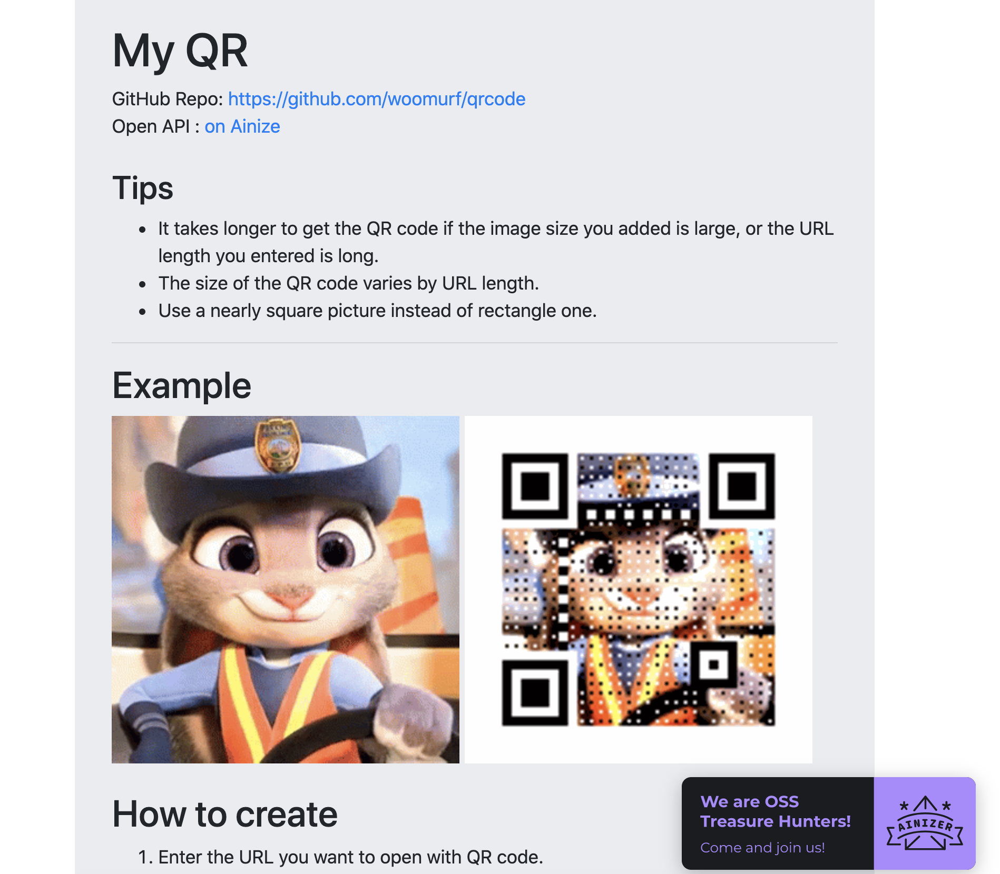
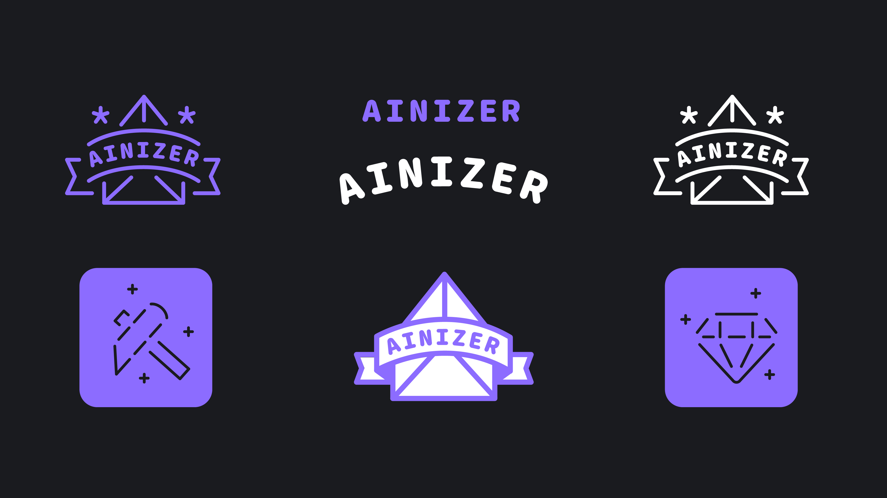

## PyCon Korea 2020

안녕하세요. 여러분!
이 웹사이트를 커먼컴퓨터 소속 Ainizers, Julia & Hanjeong 입니다. 🙋‍♀️🙋‍♂️  
컴컴(커먼컴퓨터)이 '파이콘 한국 2020'의 다이아몬드 후원사임을 기념하고자 + 여러분들을 Ainizer로 끌어들이고자  이 사이트를 만들어보았습니다. 어떤가요?

사실, 저희 컴컴에서 파이콘 한국 2020을 위해 다양한 이벤트를 준비했어요. 
부스에 가셔서 이벤트에 참여하시고, 예쁜 굿즈(에코백, 뱃지, 스티커)와 에어팟 프로도 받아가세요! 🎁

**Common Computer Virtual Booth -> [여기 클릭](https://www.pycon.kr/2020/sponsor/virtual_booth/common_computer)**

 

## Ainizer, 누구냐 넌?

거두절미하고, Ainizer에 대해 먼저 소개해드리겠습니다.   **Ainizer = Ainize + User** 를 합친 용어로, 본래 Ainize를 이용하는 유저라고 이해하기 쉽습니다. 

그러나, 결코 이들은 단순한 유저가 아닙니다.  **AI 맛집 [Ainize](https://ainize.ai/)에서 AI 최신 기술을 접하고, 실행해보고, 네트워킹에 참여하는 유저들이 모인 그룹입니다.**  

예시를 하나 들어볼게요.

Ainizer들은 오픈소스 생태계에 기여할 수 있는 오픈소스 프로젝트들을 찾아 Ainize에 배포하여, 사람들이 바로 쓸 수 있는 서비스로 만들기도 합니다. 오픈소스 세상에서 보물을 찾는 사람들이라는 이미지가 떠오르도록 "Treasure Hunter, Ainizer"라고도 합니다. 그래서 showcase에 있는 프로젝트를 실행시켜보면, 아래의 이미지처럼 우측 하단에 도장이 꽉 찍혀있답니다. 예쁘죠?

  

 

확인해보니, 벌써 많은 프로젝트들이 모였더라고요. 그래서 이 사이트를 만들었습니다. Ainizers' 프로젝트 모음집! Showcase! (왜 영어로 하니 더 있어보이는 느낌이 드는거죠?) 앞서 언급했듯이, Ainizer는 누구나 될 수 있습니다. 야, 너도 할 수 있어. Ainizer! 

  

 

## Ainizer, 나도 하고싶다!

여러분과 함께 성장하는 커뮤니티를 만들고자 합니다. Ainizer가 되고 싶다면, Ainize에 대해 궁금한 점이 있다면? 다양한 질의응답이 오가는 슬랙 커뮤니티에 들어오세요. 언제든지 질문하고, 다른 Ainizer들과 소통해보세요. 그리고 Ainize에 바라는 점, 건의사항 등 모든 이야기를 자유롭게 나눠주세요. 이 웹사이트에 대한 조언 & 의견을 주셔도 좋습니다.

- **AI Network Developer community [가입하기](https://join.slack.com/t/ainetwork-dev/shared_invite/zt-c89mb8z9-IqaCsNmsNLXKNylKXrJTTg)**

- 특별 미션: 슬랙에서 저(Julia Jo)를 찾아 인사 dm 보내기 💜

 

## Ainizer 최신 소식을 들려줄 채널

Ainize 가입은 다들 하셨죠? 안했다면 **Ainize [가입](https://ainize.ai/)**부터 하기!

- **Facebook 계정 [팔로우&좋아요](https://www.facebook.com/ainetworkofficial)**

- **Youtube 채널 [좋아요&구독](https://www.youtube.com/channel/UCnyBeZ5iEdlKrAcfNbZ-wog)** 
